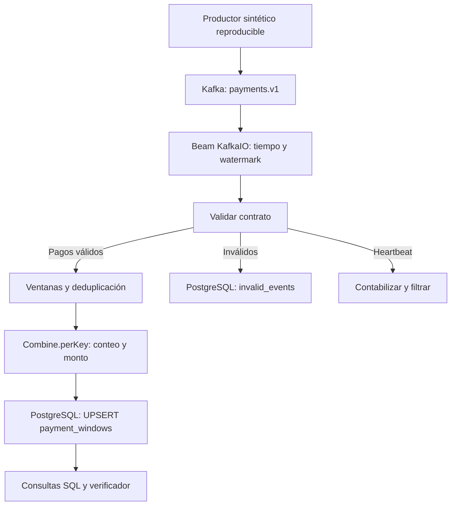

# Documento técnico

## Problema, usuarios y resultado

Un operador de comercios necesita observar volumen y monto de pagos por minuto, aun cuando la transmisión
repita mensajes o entregue pagos fuera de orden. La salida permite comparar actividad entre comercios,
detectar interrupciones y preparar alertas posteriores. No realiza liquidación financiera ni detección de fraude.
Se eligió PYG y montos enteros para evitar redondeos y mezclar monedas.

## Arquitectura

Java 17, Apache Beam 2.64.0, DirectRunner, Kafka 3.9.0 en KRaft y PostgreSQL 16.6.
KafkaIO Java evita un expansion service y un SDK harness adicional. DirectRunner permite demostrar este
volumen local sin administrar un clúster Flink. Es una elección de simplicidad, no una promesa de escalabilidad.

## Kafka y fuente

`payments.v1` tiene tres particiones y factor de replicación uno. La clave Kafka coincide con `key` (comercio).
Los pagos de un comercio van a una partición mientras no cambie su cantidad. Kafka conserva el orden de
append dentro de cada partición, no el orden de `event_time` ni un orden total entre particiones.
Tres particiones permiten distribuir comercios; un comercio dominante sigue siendo una hot key.
Aumentarlas no divide esa clave y puede alterar su asignación; no se hace durante una ejecución.

El productor espera confirmación, usa `acks=all` e idempotencia Kafka. Esto evita duplicados de ciertos
reintentos de red del productor, pero un nuevo `send` del mismo evento sigue siendo un duplicado de negocio.
El escenario lo hace explícitamente. Retención configurada: 168 horas. No hay autenticación ni réplica adicional;
los servicios se limitan a la red interna de Compose. Credenciales locales de demostración, no para producción.

El consumidor desactiva auto-commit, inicia desde earliest y no usa `commitOffsetsInFinalize`.
DirectRunner pierde estado en reinicios; por ello no se pretende reanudar con offsets que omitan el estado perdido.
Kafka permanece activo durante la prueba de reinicio del pipeline. Sus datos locales no se garantizan tras
recrear el contenedor Kafka: el caso sintético se puede regenerar. PostgreSQL sí usa un volumen nombrado.

## Contrato y validación

Ver [contrato](event-contract.md). KafkaIO asigna el timestamp desde el `event_time` del JSON validado,
con la misma función usada por la transformación de validación. Un JSON inválido no adelanta el watermark.
La salida lateral guarda clave, original y motivo en `invalid_events`, con SHA-256 como clave idempotente.
Los heartbeats son eventos de control y no entran al cálculo de dinero.

`Validate`, `Deduplicate`, `SumPayments`, `Format` y los sinks tienen responsabilidades separadas.
`SumPayments` mantiene únicamente conteo y suma por acumulador; no reúne todos los pagos en una lista.
Las sumas usan `Math.addExact`: un overflow detiene el cálculo en vez de publicar dinero incorrecto.

## Política temporal

- Ventanas UTC `[inicio, inicio+60 s)`: resolución de un minuto útil para monitoreo operativo.
- Cada partición mantiene `max(event_time válido observado) - 5 s`, monótono.
- El watermark global depende de la partición más atrasada. Una partición sin eventos puede bloquearlo.
- El productor emite heartbeats en **las tres particiones**, también en las inactivas.
- No se adelanta el watermark usando la hora del servidor: un replay histórico conserva su comportamiento.
- El marcador final demo, 12:05:00, declara progreso lógico para cerrar las ventanas del dataset finito.
  No es un pago ni representa una observación del reloj real.
- Allowed lateness: 120 s después del final de ventana respecto al watermark, no respecto a `now()`.
- Early: al menos un elemento; on-time: paso del watermark; late: al menos un elemento tardío admitido.
- Panes acumulativos. Beam puede agrupar varios elementos antes de emitir un pane; no se asume un pane por pago.
- Más allá del cierre + 120 s, Beam deja de incorporar datos a la agregación. No hay DLQ de expirados;
  el descarte se demuestra en TestStream, y se declara este límite de observabilidad.

Un heartbeat adelantado puede cerrar ventanas prematuramente: solo lo emite una fuente confiable y coordinada.
Para varias fuentes independientes se necesitaría coordinación de progreso. Si el productor se detiene,
no se garantiza el cierre de su última ventana hasta recibir progreso posterior.

## Deduplicación y estado

SetState por clave y ventana, con ID estable. Timer de tiempo de evento en `window.maxTimestamp + 120 s`
libera el conjunto. La eliminación coincide con la expiración de la ventana a precisión de milisegundos.
Horizonte: vida de la ventana más lateness, no deduplicación eterna ni un TTL de reloj real.
El ID de un hecho debe conservar clave, tiempo y monto en cada reenvío. IDs conflictivos en otra clave o ventana
están fuera del contrato; el sistema no dispone de un registro global de identidad ni reconcilia correcciones.
El crecimiento de estado depende de IDs únicos por minuto/comercio, velocidad del watermark y lateness.

## Idempotencia y fallos

Clave SQL: `(merchant_id, window_start)`. El UPSERT es atómico y reemplaza solo si aumenta `event_count`.
Como los pagos son inmutables y positivos, los acumulados completos crecen con cada evento nuevo.
Esto evita que un pane antiguo o una reconstrucción parcial sobrescriban uno más completo.
No se usa exclusivamente `pane_index`: al reiniciar el runner puede volver a cero.
Panes con el mismo conteo no modifican fila ni `updated_at`; `timing` describe el pane que actualizó dinero,
no necesariamente el último disparo on-time. Las filas son provisionales y no tienen indicador durable de cierre.

Límite: count es una versión válida bajo el contrato de conjunto acumulativo de pagos inmutables de una sola
instancia. No resuelve dos conjuntos diferentes con igual cardinalidad, anulaciones, deltas negativos, ni cambios
de lógica entre replays. Esos casos requerirían versionado de ejecución, ledger o reconciliación independiente.

Fallos transitorios SQL (conexión/clase 08 o transacción/clase 40): hasta cuatro intentos con backoff.
Si el commit ocurrió pero se perdió la confirmación, repetir el UPSERT no duplica dinero. Un error persistente
hace fallar el pipeline y queda en logs. No se ignoran excepciones para aparentar éxito.

Semántica: reentrega/replay posibles, dedup de negocio acotada y materialización idempotente bajo supuestos.
No hay transacción coordinada Kafka–Beam–PostgreSQL ni exactly-once end-to-end. Reiniciar exige retener todo el
historial de las ventanas a reconstruir; retención insuficiente puede impedir recomponer el agregado correcto.

## Observabilidad, evidencia y límites operativos

Logs `PRODUCED` con ID, timestamp, partición y offset; `RESULT` con agregado, pane y timing; `INVALID` con motivo.
Beam registra contadores consumed, valid, duplicates, heartbeats, invalid, state_expired, panes, sink_writes y db_retries.
No se incluye exportador Prometheus ni dashboard; las evidencias de operación se apoyan en logs y SQL.
`scripts/demo.sh` guarda productor, resultados SQL, verificaciones, logs de servicios y prueba de reinicio.
La suite usa TestStream para controlar exactamente el watermark; la demo Kafka prueba un evento fuera de orden.
No se presenta el orden de llegada invertido como prueba automática de tardanza respecto al watermark.

Mejoras: runner durable con checkpoints, recuperación coordinada, particiones persistentes/replicadas, DLQ de
expirados, limitación de skew, métricas exportadas, autenticación y TLS. No son requisitos implementados.

## Referencias técnicas

- https://beam.apache.org/releases/javadoc/2.64.0/org/apache/beam/sdk/io/kafka/KafkaIO.Read.html
- https://beam.apache.org/releases/javadoc/2.64.0/org/apache/beam/sdk/io/kafka/TimestampPolicy.html
- https://beam.apache.org/documentation/programming-guide/
- https://kafka.apache.org/39/configuration/producer-configs/
- https://www.postgresql.org/docs/16/sql-insert.html
